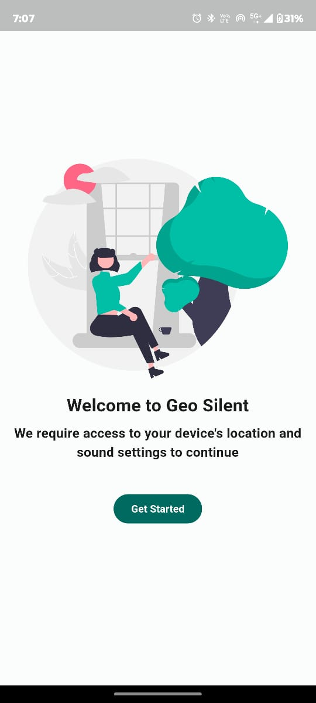
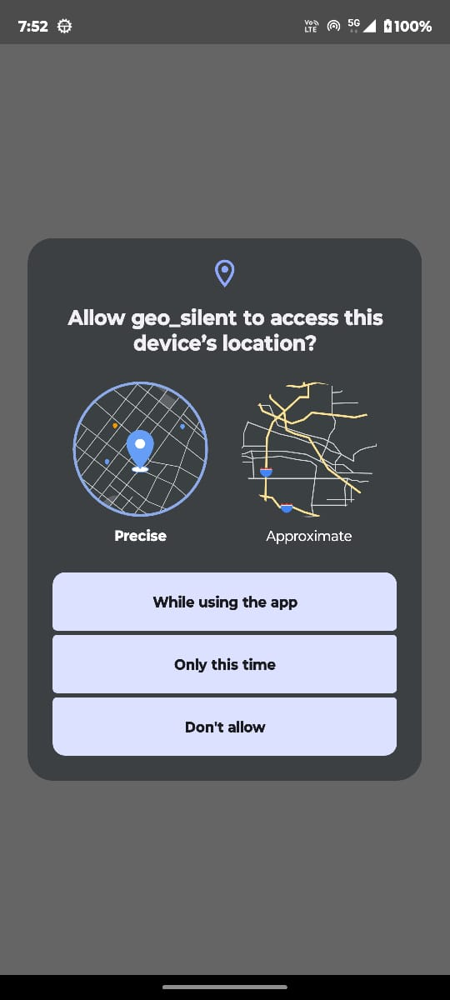
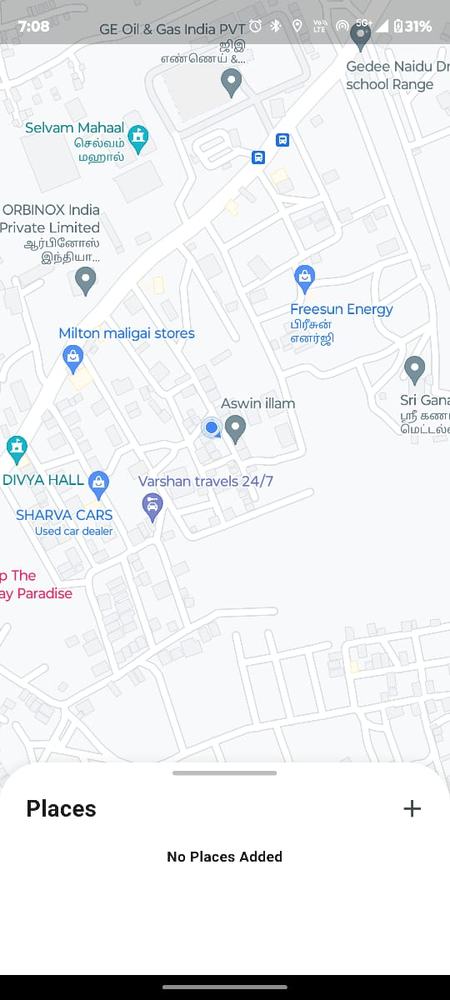
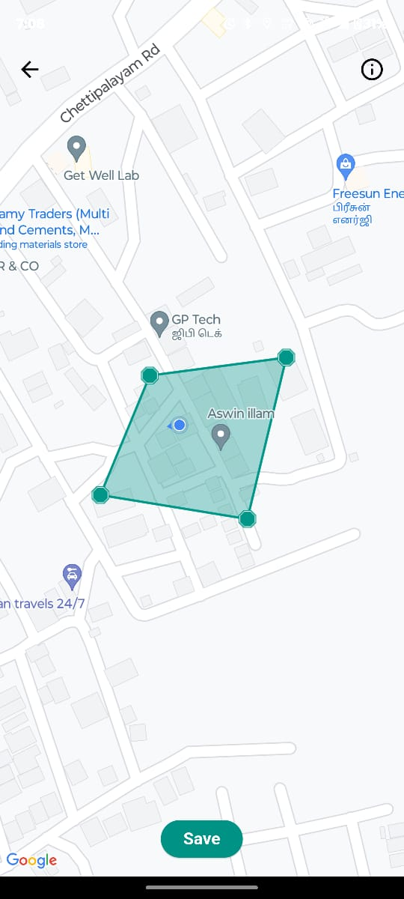
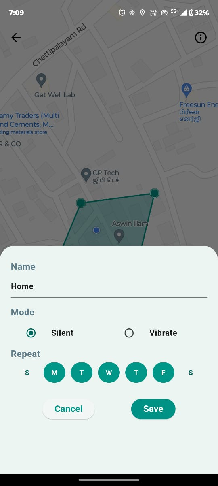
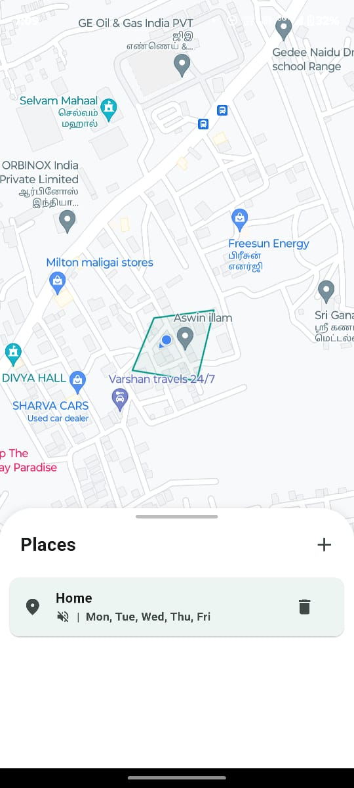

<h1 style="text-align: center;"> Geo Silent</h1>

### Getting Started

An Android application for location based sound profile using Geo fencing

### Releases
<table width="100%">
<tr>
<th>Date</th>
<th>Version</th>
<th>File</th>
</tr>
<tr>
<td>17/04/2024</td>
<td>geo-silent-0.0.1</td>
<td><a href='./data/outputs/geo-silent-v-01.apk'>0.0.1</td>
</tr>
</table>